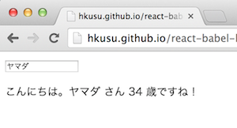

# react-babel-browserify-gulp-sample

これは [React.js](https://facebook.github.io/react/) を学習する為の環境のサンプルです。特徴は次のとおりです。

- ECMAScript 6 構文のサポートおよび JSX ファイルのコンパイルに [Babel](https://babeljs.io/) を利用
- 依存モジュールの管理(CommonJS準拠)に [Browserify](http://browserify.org/) を利用
- タスクランナーとして [gulp](http://gulpjs.com/) を利用

## 利用方法

```
$ git clone https://github.com/hkusu/react-babel-browserify-gulp-sample.git
$ cd react-babel-browserify-gulp-sample
$ npm install
```

上記のように `$ npm install` を実行することにより、`package.json` の内容に従って本プロジェクトの `node_modules` 配下に今回利用するモジュール郡が展開されます。

メインロジックは `app.jsx` です。これを書き換えて動作確認しながら学習を進めます。

> 冒頭に書いたとおり ES6 構文の利用および CommonJS スタイルのモジュール管理(require や exports)が利用できます。`message.jsx` はクラスを別ファイルへ分割した例です。

## 動作確認の方法

`$ npm run build`（または `$ ./node_modules/.bin/gulp browserify`）とすると、`app.jsx` および `app.jsx` から読み込んでいるファイル郡から `bundle.js` が生成されます。
`bundle.js` は `index.html` で読み込んであるので、`index.html` を適当なブラウザで開いてください。

もしくは `$ ./node_modules/.bin/gulp` とすることでも `bundle.js` を生成することが出来ます。この場合は gulp のタスクが JSX ファイルの変更を監視しているので、JSX ファイルを修正して保存すると自動的に `bundle.js` が再生成されます。また内部的にWEBサーバが立ち上がっているので、適当なブラウザで `127.0.0.1:8000` にアクセスすることにより動作確認することも出来ます。

> ポート番号(8000)は環境によって異なるかもしれません。

gulp のタスクは `gulpfile.js` で定義しています。挙動を変更する場合は適宜このファイルを書き換えてくだささい。

## サンプル・アプリケーション

とりあえず簡単なデータバインドを React.js で実装してあります。



デモは [こちら(GitHub Pages)](http://hkusu.github.io/react-babel-browserify-gulp-sample/) で確認できます。

実装内容については `app.jsx` および `message.jsx` をご覧ください。

## License

MIT
